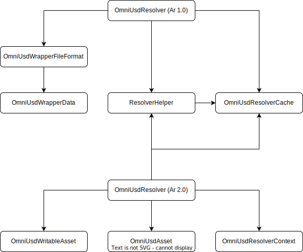

OmniUsdResolver Overview
========================

OmniUsdResolver
---------------

The main entry point to resolving assets within Omniverse for USD. `OmniUsdResolver` is transparently integrated into USD by
deriving from and implementing the ArResolver API. It is not intended to be invoked directly but rather through the
`PlugRegistry` system within USD which is declared via it's "plugInfo.json" metadata. Any calls to deal with
resolving assets should go through the ArResolver API which can be obtained via `ArGetResolver()`.

`OmniUsdResolver` supports a wide variety of USD versions along with different "flavors" for those versions.
This range of builds for so many versions of USD requires support for both ArResolver 1.0 and ArResolver 2.0 APIs.
The version of ArResolver to use is determined at build-time, via the USD dependency, and will appropriately build
the corresponding `OmniUsdResolver`. Documentation specific to a particular ArResolver version of `OmniUsdResolver`
will be suffixed by the ArResolver version. For example, details about `OmniUsdResolver` for Ar 2.0 will be
`OmniUsdResolver (Ar 2.0)`

ResolverHelper
--------------

The ArResolver API is quite different between Ar 1.0 and Ar 2.0 versions. But the main concepts of creating an identifier
and resolving assets are mostly similar for the underlying implementation. For this reason the `ResolverHelper`
was added as a simple utility class that provides shared functions for both `OmniUsdResolver (Ar 1.0)` and
`OmniUsdResolver (Ar 2.0)`.

OmniUsdResolverCache
--------------------

The `OmniUsdResolverCache` is a very simple key-value store caching mechanism that can be used to
cache scoped areas of code where assets are frequently resolved. Internally, the `OmniUsdResolverCache` uses a
`tbb::concurrent_hash_map` to cache the resolved results to ensure thread-safety. This should allow the
`ArResolverScopedCache` to be used across threads. As with most things in Ar, the `OmniUsdResolverCache` is created
indirectly through the `ArResolverScopedCache` which uses RAII to control lifetime of the cache.

    It is the responsibility of the caller to scope caching accordingly. Without explicitly creating a `ArResolverScopedCache`,
    `OmniUsdResolver` will not cache it's computed results, although `client-library` may perform some of it's own caching.
    This is important for cache misses as the results of those failed resolves will be cached within the duration of the
    `ArResolverScopedCache` lifetime. The benefit of scoped caches is that the caller controls cache invalidation.

OmniUsdResolver
---------------

The `OmniUsdResolver` implementation that implements the Ar 2.0 `ArResolver` abstraction. It is intended to be used
as a primary `ArResolver` but it can also be configured as a URI `ArResolver`. Since the `OmniUsdResolver` ultimately
calls `client-library` it supports all protocols that `client-library` supports. Currently, the following protocols
are supported:

#. omniverse://, omni:// (Nucleus)
#. http://, https:// (Web, with extra support for S3)
#. file:// (File URI)
#. POSIX (Linux file paths)
#. Windows (Windows file paths)

For more information on Primary Resolvers vs URI Resolvers see :doc:`resolver-details`

OmniUsdResolverContext
----------------------

`OmniUsdResolverContext` is an `ArResolverContext` that simply stores the base asset path. This base asset path is
usually, but not always, the root layer associated with the `UsdStage` that bound the context. The
`OmniUsdResolverContext` is intentionally kept pretty bare-bones to prevent assets from resolving differently based
on the bound context. Contextual information stored within a `ArResolverContext` is not persisted within scene
description which can make it difficult to reproduce the same asset without the exact same context.

OmniUsdAsset
------------

Implements the `ArAsset` interface which is required for reading the binary data from resolved Nucleus assets.
An instance is obtained via `OpenAsset()` on the `ArResolver` abstraction, or more succinctly
`ArGetResolver().OpenAsset()`

For more information on Reading Assets see :doc:`resolver-details`

OmniUsdWritableAsset
--------------------

Implements the `ArWritableAsset` interface which is required for writing binary data to resolved Nucleus assets.
An instance is obtained via `OpenAssetForWrite()` on the `ArResolver` abstraction, or more succinctly
`ArGetResolver().OpenAssetForWrite()`

For more information on Writing Assets see :doc:`resolver-details`
